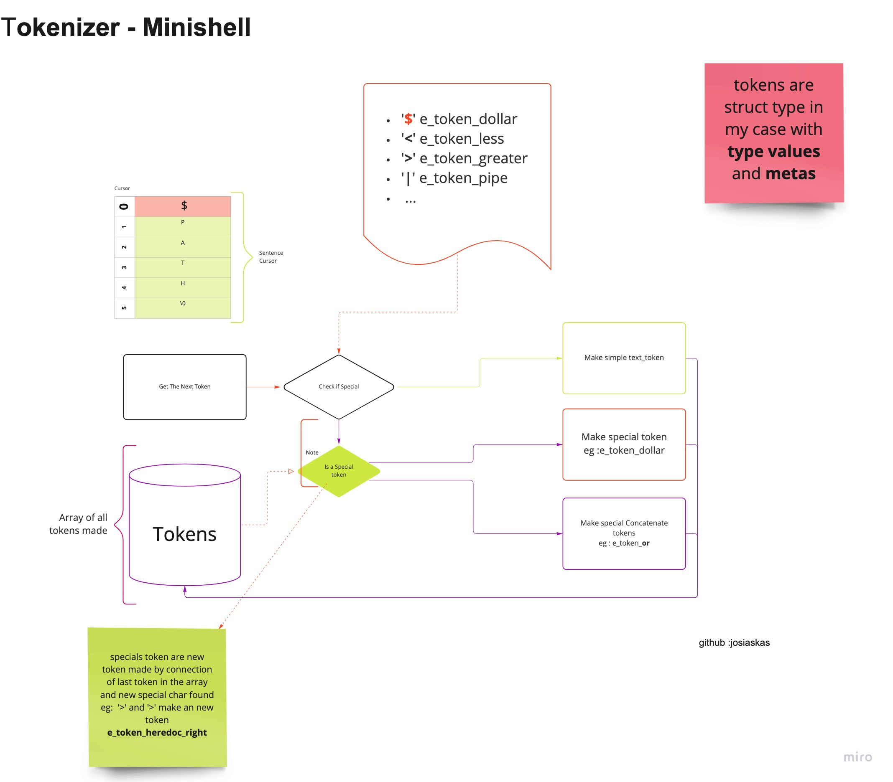
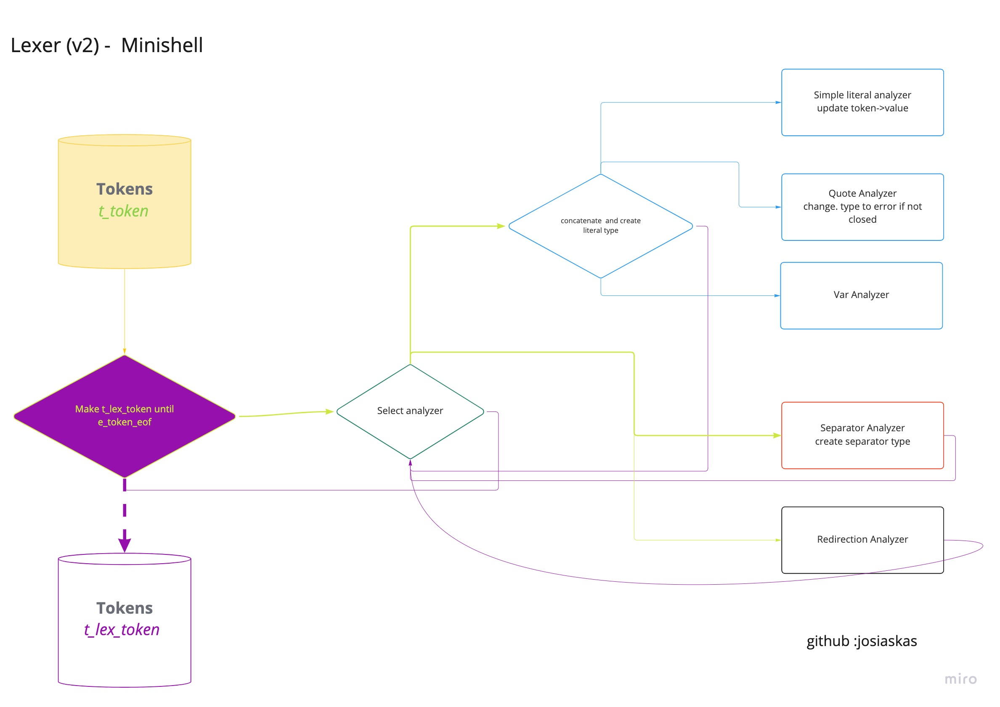

# MINISHELL (In construction - mandatory part)


L’objectif de ce projet est de créer un shell minimaliste.
Un projet super interessant pour apprendre plus sur les processus, les descripteurs de fichier, les signaux et certains system call. (***version 6*** 42)


***Pour l'instant dans le projet :***
- redirection '> >> < <<';
- pipes
- un quote ' ou double quote " non fermé devient un caractère simple (pas de quote>)
- / et les autres && & sont des caractères simples

 ```sh
  git clone --recurse-submodules git@github.com:josiaskas/minishell
 ```
 
## 1. Command mode

- seul le flag -c est accepté ensuite la ligne à exécuter.
  ```shell
   ./minishell -c "echo hello world"  
  ```
- les ficher script ***ne sont pas pris en charge***. Donc pas de ***./minishell script.sh***
## 2. Loop (interactive mode)

#### 2.1 signals
```C
int	minishell_loop(void)
{
  //...
	while (1)
	{
      activate_signal_handling(); // À chaque fois dans la boucle (tous les signaux sont désactivés par certains bout de code)
    //...
  }
   //...
}

void	activate_signal_handling(void)
{
	setup_signal(SIGINT, handle_sigint);
	setup_signal(SIGQUIT, SIG_IGN);
}
```
#### <span style="color:blue">info (readline lib)</span>

Malheureusement `handle_sigint` fait appelle a la fonction `rl_replace_line`, fonction qui est une source de problème pour la librairie readline utiliser sur les Mac (Pour des raisons de licence).

libreadline.a (celle dans le dossier est compilé pour Catelina) est une version spéciale. Le Makefile a été ajuster pour pointer vers le bon chemin.

J'ai délibérément pas voulu prendre les fichiers .h de la lib (42 norminette), j'ai ajouté dans status.h la definition de cette fonction.
```C
void	rl_replace_line(const char *text, int clear_undo);
```

Si vous compilez sous linux il faudra changer les flags ***-L*** dans le Makefile

 note : readline a des "still reachable" blocks.

## 3. Parsing

#### 3.1 tokenizer et lexer

Pour le parsing j'ai choisi de le faire en 3 étapes. Deux d'entre elles sont liées, tokenization et l’analyse lexicale. 
Normalement sur le plan scientifique, c'est sensé designer la meme chose à peu près, [Analyse lexicale](https://fr.wikipedia.org/wiki/Analyse_lexicale). Ce qui est certain, c'est la première partie une partie de mon [Analyseur syntaxique](https://fr.wikipedia.org/wiki/Analyse_syntaxique).

<table style="padding:10px">
  <tr>
	<th>Tokenizer</th>
	<th>Lexer</th>
  </tr>
  <tr>
    <td> 
        
    </td>
    <td> 
         
    </td>
  </tr>
</table>

- Plus de details sur le tokenizer ici [Tokenizer wiki](https://github.com/josiaskas/minishell/wiki/Tokenizer)
- Plus de details sur le lexer ici [Lexer wiki](https://github.com/josiaskas/minishell/wiki/Lexer)

Le tokenizer peut simplement être modifié en ajoutant des caractères special.

#### 3.2 Le parser

Il permet la création des t_command, une structure, qui va par la suite aider à l'exécution. En cas de problème, par exemple un token inattendu une erreur est créé puis remonte tout l'arbre des t_command. Elle devient ensuite une erreur du parseur. 
- Si le créateur de commande rencontre un token de type pipe. Il commence la creation d'une autre commande, un appel récursif est fait, la commande créer est ensuite mise dans `cmd->pipe`
- Pour le bonus il faudra faire la même chose avec `cmd->next` et set les conditions d'exécutions de `cmd->next`


- Plus de details sur le lexer ici [Parser wiki](https://github.com/josiaskas/minishell/wiki/Parser)

## 4 Execution

#### 4.1 Redirections

On execute premièrement les redirections (Sauf en cas de pipeline).
Le parseur permet d'avoir un tableau rempli de la structure t_redirection.

```C
typedef struct s_redirection {
	int					fd;
	t_redirection_type	type;
	char				*filename;
}	t_redirection;
```

On execute à la suite chacune d'entre elles. Ce qui permet de fermer puis ouvrir a souhait. Le tableau  ``` command->fd ``` est constament modifer.
- note : Il n'y a pas de traitement pour certaines redirection ```shell 2>&1 ``` ou ```shell 2> filename ```. 

#### 4.2 Heredoc

Ce type de redirection est exécutée avant le forking de chaque commande.
- Ce qui permet en cas de ctrl-c dans un heredoc de ne rien exécuter dans la pipeline.
- On parcours toute les commande et on execute les heredocs les uns à la suite des autres.
#### 4.3 Pipeline

***Entrée***
- Une pipeline est une liste chainée de plusieurs t_command lié par le pointeur pipe.
- Les pipes sont assignées 
- Chaque t_command est exécutée et on garde le pid dans la structure pour avoir le status du process. 
- Seul le dernier status de la liste des t_command peut modifier le status global.
- On fait un wait pour chaque pid des commandes créer.

***Chaque Process Enfant***
- chaque process reçoit le t_command qui lui été assigné.
- Les autres types de redirections autres que heredoc sont exécutées
- On essaye d'exécuter

by josiaskas
